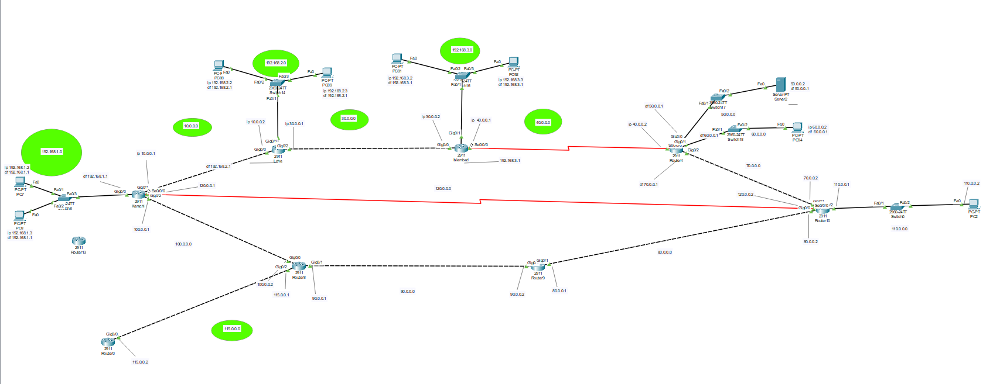
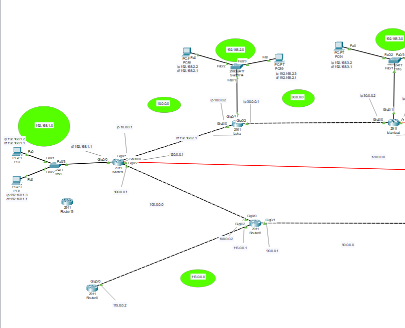
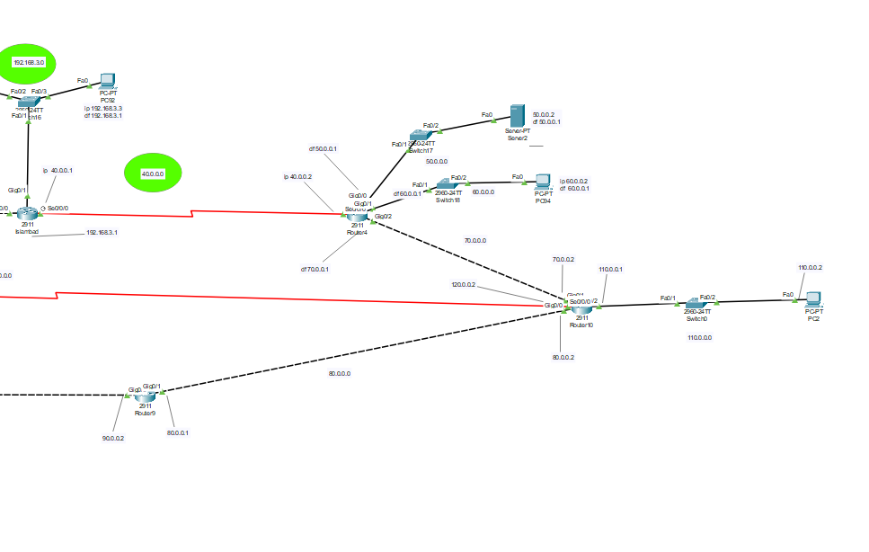

# Administrative Distance Lab (AD-Lab)

This lab demonstrates the concept of **Administrative Distance (AD)** in routing, showcasing how routers select the best route when multiple routing protocols or static routes offer paths to the same destination.

## 🧠 Objective

To simulate and observe how routers make routing decisions based on AD values. This includes:
- Static routes
- Floating static routes
- Dynamic routing protocols (e.g., RIP, EIGRP, OSPF)
- Failover behavior using backup routes

## 🖥️ Topology Overview

The network consists of multiple routers, switches, and end devices segmented into different networks such as:
- `192.168.1.0/24`, `192.168.2.0/24`, `192.168.3.0/24` (LAN segments)
- Core routing between routers using networks like `10.0.0.0/30`, `100.0.0.0/30`, etc.
- Redundant paths (some with higher AD) between major routers to test failover behavior

📸 Click to view topology images

- 
- 
- 

## ⚙️ Configuration Notes

- **Primary Routes**: Use static or dynamic protocols with lower AD.
- **Backup Routes**: Floating static routes with higher AD values configured for failover.
- **Router Fail Simulation**: Disconnect primary links to observe AD-based fallback routing.

## 🔧 Tools Used

- Cisco Packet Tracer
- Cisco 2911 Routers & 2960 Switches
- PCs and Servers for traffic simulation

## ✅ Learning Outcomes

- Understand the purpose and influence of Administrative Distance
- Configure multiple route types on routers
- Test routing failover mechanisms using floating static routes
- Analyze routing tables and convergence behavior

## 📁 Files

| File Name             | Description                                 |
|----------------------|---------------------------------------------|
| `AD-Lab.pkt`          | Packet Tracer lab file                      |
| `README.md`           | This documentation                         |

---

**Tip**: Use the `show ip route` and `show ip protocols` commands to verify route preferences on each router.

