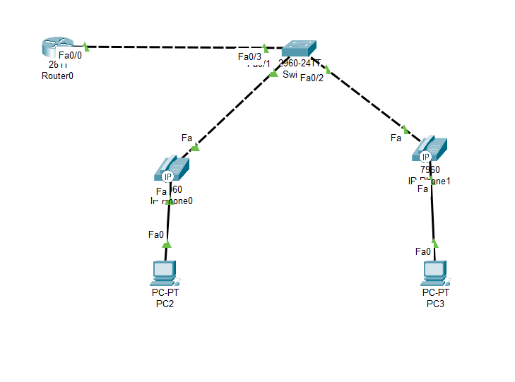

# VoIP Lab – IP Telephony Simulation using Packet Tracer

This lab demonstrates the configuration and working of a **basic VoIP (Voice over IP)** network in Cisco Packet Tracer using IP phones, routers, switches, and PCs.

## 🧠 Objective

To simulate IP-based voice communication in a small office setup. Key goals:
- Configure DHCP on the router to assign IP addresses to phones and PCs
- Enable voice VLANs for IP phones
- Verify IP phone registration and communication between devices

## 🖥️ Topology Overview

The network includes:
- **Router0** (DHCP Server)
- **2960 Switch** (Central switch connecting all devices)
- **Two IP Phones** (`IP-Phone0`, `IP-Phone1`)
- **Two PCs** (`PC2`, `PC3`) connected behind the IP phones
- **Voice and Data VLAN configuration**

<details>
<summary>📸 Click to view topology</summary>



</details>

## ⚙️ Configuration Summary

### 🔧 Router (Router0)
- **DHCP Pool** for Data VLAN (e.g., `192.168.1.0/24`)
- **DHCP Pool** for Voice VLAN (e.g., `10.0.0.0/24`)
- `Fa0/0` configured with subinterfaces:
  - `.10` for Voice VLAN
  - `.20` for Data VLAN

### 🔧 Switch (2960)
- Access Ports:
  - IP Phone + PC on same port using voice and data VLAN
- Trunk link between Router and Switch
- VLANs created:
  - `VLAN 10` – Voice
  - `VLAN 20` – Data

### 🔧 IP Phones
- Receive IP from DHCP
- Registered and display directory number (DN)

### 🧪 PCs
- Connected through IP phones
- Must also receive IP addresses from the data VLAN pool

## 📁 Files

| File Name            | Description                        |
|---------------------|------------------------------------|
| `voip.pkt`       | Cisco Packet Tracer project file   |
| `README.md`          | This documentation                |
| `topology.png` | The topology's screenshot from the file      |

## ✅ Learning Outcomes

- Understand the working of IP telephony
- Configure voice and data VLANs on Cisco switches
- Deploy DHCP with subinterfaces
- Simulate communication between IP phones
- Troubleshoot basic VoIP connectivity issues

## 📘 Commands Reference

### On Router:
```bash
interface fa0/0.10
 encapsulation dot1Q 10
 ip address 10.0.0.1 255.255.255.0

interface fa0/0.20
 encapsulation dot1Q 20
 ip address 192.168.1.1 255.255.255.0

ip dhcp pool VOICE
 network 10.0.0.0 255.255.255.0
 default-router 10.0.0.1
 option 150 ip 10.0.0.1

ip dhcp pool DATA
 network 192.168.1.0 255.255.255.0
 default-router 192.168.1.1
```

## ON Switch:
```bash
vlan 10
 name Voice
vlan 20
 name Data

interface fa0/1
 switchport mode access
 switchport access vlan 20
 switchport voice vlan 10

interface fa0/2
 switchport mode access
 switchport access vlan 20
 switchport voice vlan 10

interface fa0/3
 switchport mode trunk
```

Note: Use `show ip dhcp binding` on the router to confirm assigned IPs and verify phone registration status.

